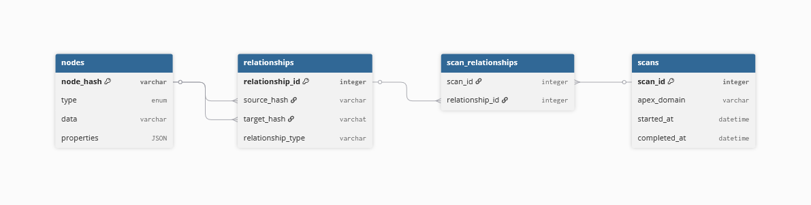
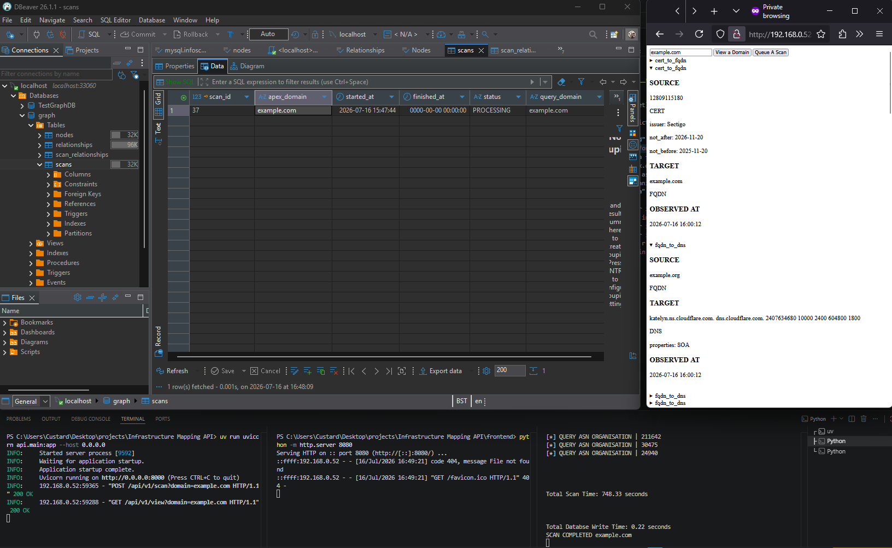

# Overview

An asynchronous passive reconnaissance graphing tool for historical infrastructural mapping across ASN, pDNS, DNS and CT log data.

Capable of storing historical data within a MySQL DB and cleanly displaying (to be implemented) relationships between infrastructure for educated defensive and offensive decision making and asset discovery.

Designed to save time and effort for penetration testers, bug bounty hunters and security specialists.

```
Sources (crt.sh / Virustotal / CertSpotter / Cymru ASN)
		↓
Semi-Asynchronous Orchestration Pipeline (Re-query System)
		↓
Asynchronous Fetching Layer
		↓
Scope Expansion Layer
		↓
Processing Layer (Normalisation + Deduplication + Internal Graph Store)
		↓
Persistence Layer (Serialisation + MySQL Graph Store)
		↓
Optional Export Layer (JSON Normalisation)
```

**Usage**
```
infra_mapper.py -d [DOMAIN ...] [options]

CT Log, pDNS, DNS, and ASN graph orchestration tool

options:
  -h, --help            show this help message and exit
  -d, --domains DOMAIN [DOMAIN ...]
                        One or more domains to enumerate
  -o, --output OUTPUT   Write results to JSON file, default [./graph.json]
```

---

# System Design

**Data Model Evolution**

- Initially used nested dictionaries for edge relationship mappings.
- This became inefficient due to nested lookups and model expansion.
- Transitioned to a graph model to better represent many-to-many relationships.
- SHA256 edge referencing for one way lookup-tables and reduced data size.

**Pipeline Architecture**

- Clear separation of responsibilities; ingestion, expansion, processing and orchestration.
- Hybrid asynchronous design to adhere to rate limits and tackle ingestion bottlenecks.
- Centralised graph for direct graph insertion and single source of truth.

**Future Implementation**

- Front-end UI: Clear graph expansion, relationship visibility, and filter application.
- Database: Store results with dates to convert from data ingestion to data monitoring.
- Potential for AI result result inference such as automated infrastructure / operational clustering or confidence assignment based on shared ASN / DNS / CT relationships

**Entity Relationship Diagram**



- Scans table for historical tracking, provides a vector for grouping relationships from seperate scans, newly discovered relationships can be easily tracked.
- Junction table to facilitate many-to-many between scans and relationship
- Nodes table utilises `node_hash` as its PK for guaranteed, uniqueness without the requirement of a constraint, and reduced writing operations saving on API run time.
  
---

# Engineering Decisions & Trade-offs

> **Trade-off: Hashing Strategy vs Sequential IDs**
>
> Selecting a referencing system for edges to reduce export dataset size: Hashing provided direct hashing tables without the requirement of reverse-lookup tables, although more complex, entries could be re-hashed rather than correlated to a table resulting in O(1) searches. Sequential IDs require reverse-lookups or O(n) searches.

> **Trade-off: Graph vs Dictionaries**
> 
> Dictionaries resulted in complex search and unpacking operations with unclear naming conventions and messy code. A graph allowed for a centralised knowledge-base without the need of passing around lists - furthermore, interacting with the graph can be done directly within it reducing additional functionality outside of it, resulting in cleaner pipelines.

> **Trade-off: Synchronous vs Asynchronous Fetching**
> 
> Synchronous orchestration results in higher stability, with higher connection success rates to unstable APIs (crt.sh) at the cost of speed ~30-45% slower. Hybrid asynchronous fetching allowed me to maintain the stability of DNS and BGP (TXT records) fetching due to its already fast, and typically larger ingestion size. While substantially increasing the speed of pDNS + CT log reconnaissance. I am happy to lose connection success rate, due to the usage of several sources and a fail-safe in case the first connection fails and the scope is not expanded.

> **Decision: SQLite vs MySQL vs PostgreSQL**
> 
> This decision was mainly influenced by industry standards, I selected MySQL due to it being the most used, with the idea of transitioning to a neo4j solution for graph analysis while utilising MySQL for historical data persistence. I chose not to utilise
sqlite despite its portability as I wanted a more robust solution that is scalable. SQLite was avooided because the system is desinged around concurrent ingestion through future worker processes. A server based solutions provides more robus concurrency and better operational flexibility (management).

> **Decision: Flask vs FastAPI vs NodeJS**
> 
> I opted to utilise FastAPI out of the above options: NodeJS although providing a common language between the front-end and the backend, A simple front-end will be sufficient javascriptlearning for now while providing me time to focus on a versatile python knowledge base. In relation to the Python frameworks - Django was also an option, however I believe it provides too many features, which would eliminate a lot of manual work (loss of learning). Although, flask is a more matured option with plenty of tutorials and additional libraries, FastAPI works well with my current program due to its inherrent asynchronous capabilities and more manual configuration approach.

> **Decision: Dedicated Workers vs Subprocess vs Redis**
>
> I chose to opt for a bit of a hybrid model, dedicated workers will be the primary task spawners while I have the option of scaling to a supervisor that automatically deploys more dedicated workers via the pythonsubprocess module. I chose not to use redis for now, due to the low scale of my program overall resulting in overengineering and additional work that is simply unnecessary at the moment, however it is a potential implementation for the future. Subprocesses utilise much more resources due to spawning a brand new interpreter - imports and database connections per subprocesses - while a single worker could spawn a database connection and pass it amongst its jobs.

---
# Program Demonstration


# Dependencies

```
aiohttp==3.14.1
dnspython==2.8.0
mysql_connector_repackaged==0.3.1
python-dotenv==1.2.2
Requests==2.34.2
tldextract==5.3.1
```

